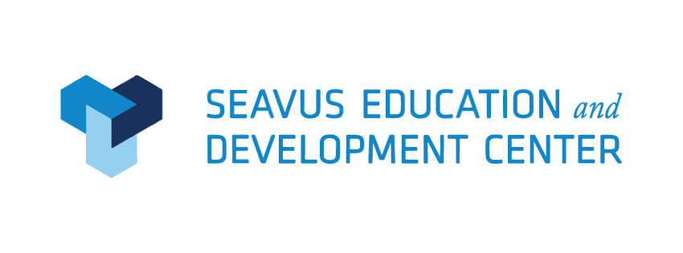

 
+ 

+


## Sedcgram

Instagram clone done with Vuejs and Bootstrap on the Vuejs Course at SEDC in 2018. For future students' purposes I migrated the project to Vue CLI 3.

## Original repository

https://github.com/pavloskii/sedc-ohrid-2018-vuejs

## Download and run project

```
git clone https://github.com/pavloskii/sedc-gram.git
cd sedc-gram
npm i
npm run serve
```
